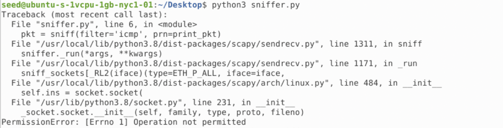
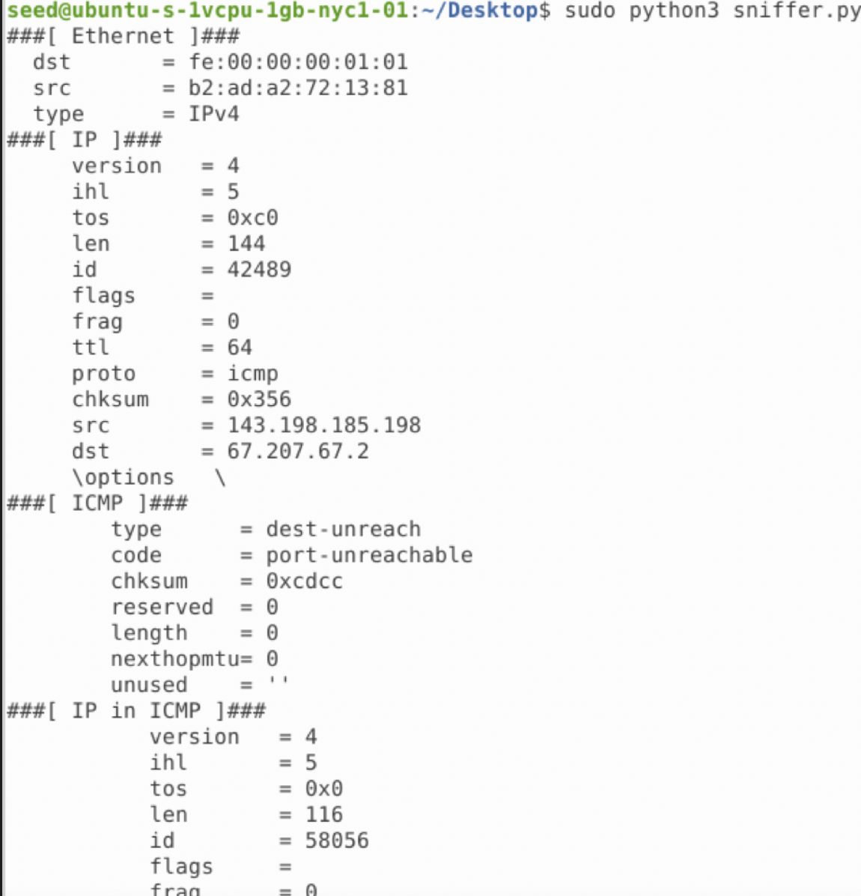

task 1.1a: write a python program using scapy that sniffs packets

The code

```python
from scapy.all import *
def print_pkt(pkt):
  pkt.show()

pkt = sniff(iface=’br-c93733e9f913’, filter=’icmp’, prn=print_pkt)
```


Running the program without privilege, we get an error: Operation not permitted



Running the program with root privilege, we are able to sniff packets



-----------------------------


task 1.1b


Capture only the ICMP packet

```python
from scapy.all import *

def print_pkt(pkt): 

	if pkt[ICMP] is not None:
		if pkt[ICMP].type == 0 or pkt[ICMP].type == 8:
			print("ICMP Packet=====")
			print(f"\tSource: {pkt[IP].src}")
			print(f"\tDestination: {pkt[IP].dst}")

			if pkt[ICMP].type == 0:
				print(f"\tICMP type: echo-reply")
			
			if pkt[ICMP].type == 8:
				print(f"\tICMP type: echo-request")


pkt = sniff(iface=’br-c93733e9f913’, filter='icmp', prn=print_pkt)
```

The result


-----------------------------

Capture any TCP packet that comes from a particular IP and with a destination port number 23.

Capture packets comes from or to go to a particular subnet. You can pick any subnet, such as
128.230.0.0/16; you should not pick the subnet that your VM is attached to.